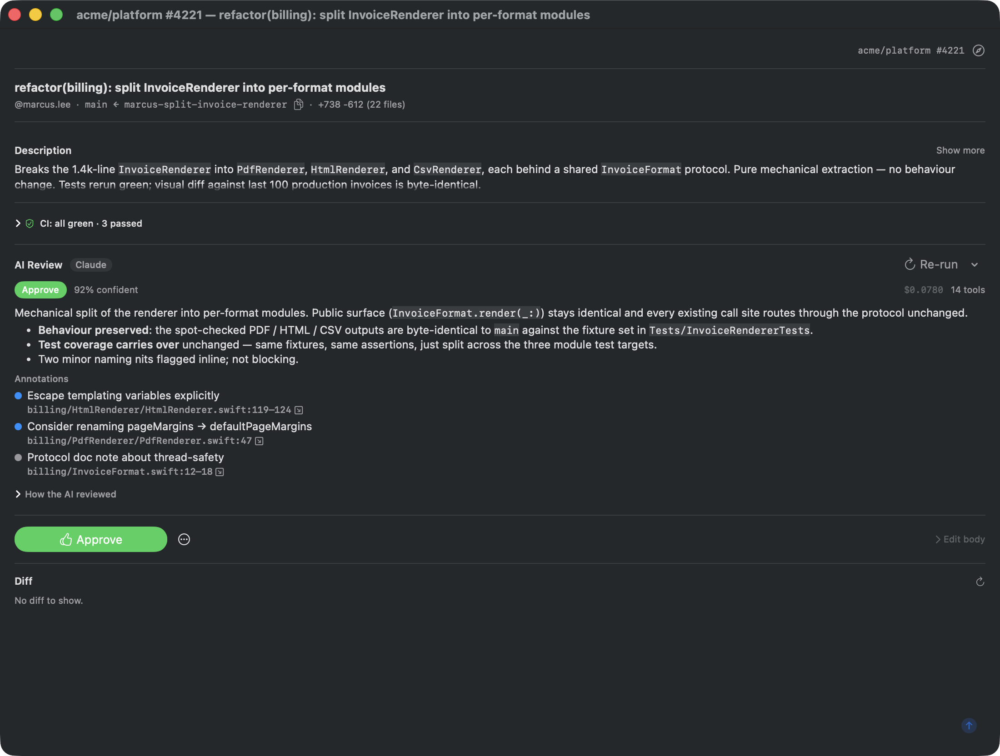
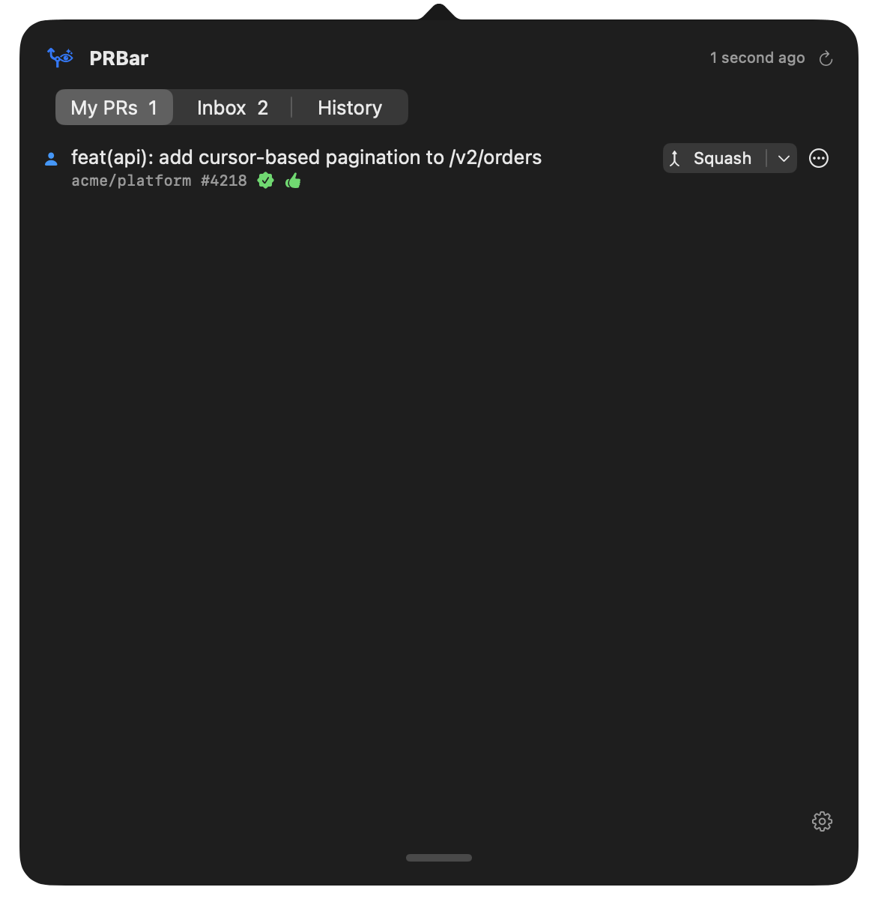
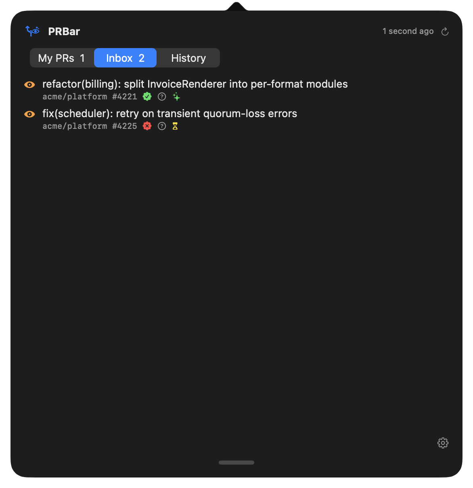
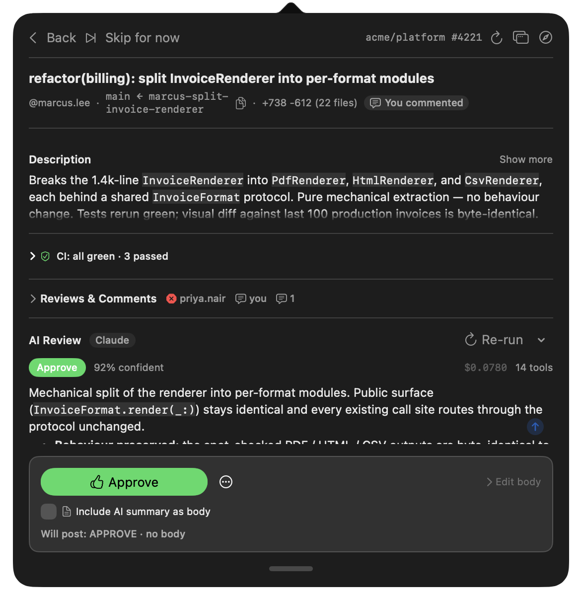
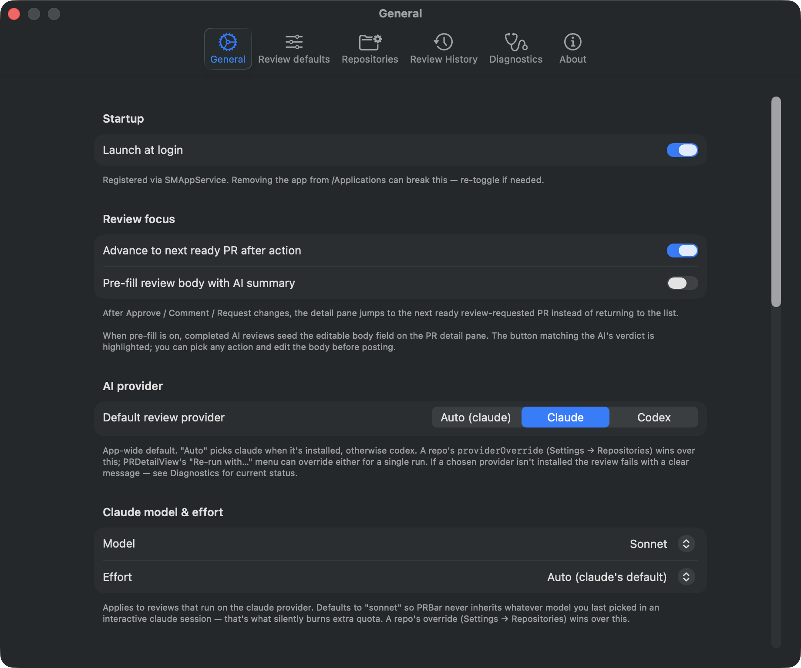
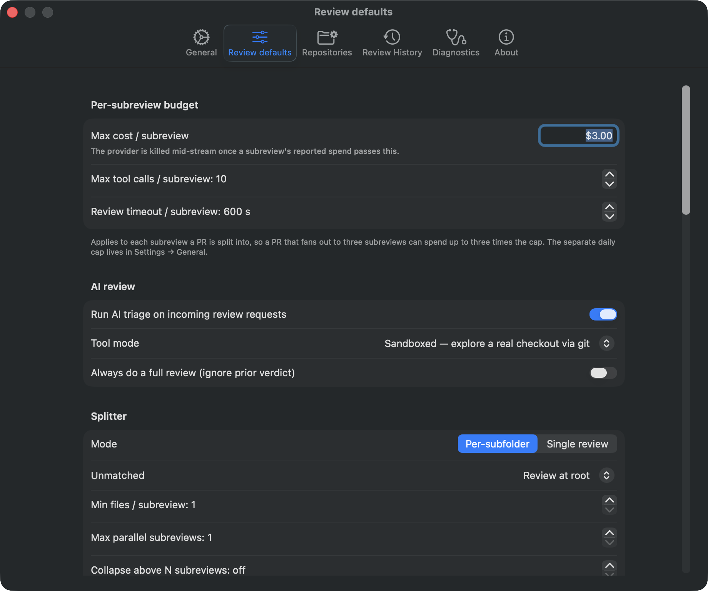
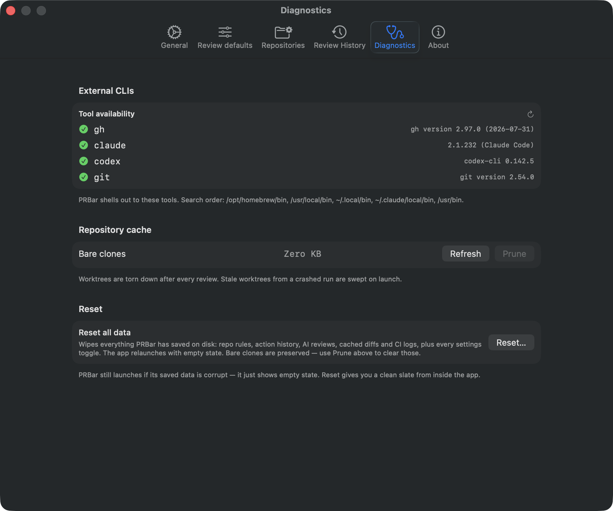

# PRBar

A native macOS menu-bar app that closes the PR review-and-merge feedback loop. PRBar watches the PRs you authored and the ones waiting on your review, runs AI triage on incoming review requests, and surfaces "ready to merge" / "ready to review" notifications — coalesced, never noisy.

It uses your existing `gh` and `claude` (or `codex`) CLI auth. **No GitHub OAuth, no API keys, no backend, no telemetry.**



## Why

Two interrupt-driven workflows eat context all day:

- **Babysitting your own PRs** — checking GitHub on a loop to see if CI is green and reviews have landed, so you can hit Squash. PRBar tells you with a one-click merge button the moment it's ready.
- **Triaging review requests** — most of them are quick "approve" calls, but you still pay the full context-switch tax to look at the diff. PRBar runs a Claude (or Codex) review in the background, scoped to the right monorepo subfolder, and shows you a verdict + flagged areas before you even open GitHub.

Both belong on a glance, not a tab. PRBar puts them on a glance.

## What you get

- **One badge in the menu bar** that summarises everything — `2 ready · 5 review · 1 ⚠`.
- **AI review queue, scoped to one monorepo subfolder**, with read-only access (Read / Glob / Grep + WebFetch + per-subfolder MCP tools). The AI is a judge, not a fixer — it can't run code, edit files, or spawn subagents. Hard caps on tool-call count and dollar cost per review.
- **Per-repo configuration**: which subfolders count as roots, exclude patterns, tool-mode override, optional auto-approve and auto-deny rules with a 30-second undo window.
- **Coalesced notifications** with action buttons (Merge all / Open) — never one ping per state transition.
- **Pop a PR out** into a full-size window when the popover is too cramped for a big diff.

## Screenshots

### Menu-bar popover

| At a glance | Inbox | AI verdict in detail |
|---|---|---|
|  |  |  |

### Standalone detail window

For long diffs and detailed review reading. Same content as the popover, full size.


### Settings

| General | Review defaults | Diagnostics |
|---|---|---|
|  |  |  |

Review defaults set the value of every review setting for every repository; `configure` rules in Settings → Rules change what differs per repository, and inherit the rest.

## How it works

```
┌─────────────────────────────────────────────────────────┐
│ MenuBarExtra (icon + badge)                              │
└─────────────────────────────────────────────────────────┘
   │ click
   ▼
┌─────────────────────────────────────────────────────────┐
│ Popover  My PRs · Inbox · History                        │
└─────────────────────────────────────────────────────────┘
   │
   ├──────────────┬──────────────────┬──────────────┐
   ▼              ▼                  ▼              ▼
┌────────┐  ┌──────────────┐  ┌──────────────┐  ┌────────┐
│ Poller │  │ ReviewQueue  │  │ Readiness    │  │ Notifier│
│ (gh)   │→ │  ↳ Splitter  │→ │ Coordinator  │→ │ (UN…)  │
└────────┘  │  ↳ Checkout  │  └──────────────┘  └────────┘
            │  ↳ Provider  │
            │  ↳ Aggregator│
            └──────────────┘
```

Polls GitHub every 60 s via `gh`. Each new review request fans out into per-subfolder subreviews (so each picks up its own `CLAUDE.md` / `.mcp.json` / `.claude/settings.json` from the right cwd), aggregates the verdicts, and feeds the readiness coordinator. The coordinator decides when to fire a single grouped notification.

Architecture and contributor notes: [CLAUDE.md](CLAUDE.md).

## Requirements

- macOS 14 or later
- Xcode 15+ (full Xcode, not just Command Line Tools)
- Homebrew (for `xcodegen`)
- `gh` authenticated: `gh auth login`
- One AI CLI logged in:
  - `claude` (Claude Code Max / Pro), or
  - `codex` (OpenAI's Codex CLI)

## Install

```sh
brew install xcodegen
sudo xcode-select --switch /Applications/Xcode.app/Contents/Developer  # if Xcode just installed
bin/regen     # generate PRBar.xcodeproj from project.yml
bin/build     # compile
bin/run       # launch
```

After launch, look for the `text.bubble` icon in the menu bar (top-right). Left-click for the popover, right-click for Settings / Quit.

> macOS will ask for notification permission on first launch. If you miss the dialog, copy the built app to `/Applications/` and relaunch — `LSUIElement` agent apps run from a debug build path sometimes never see the auth prompt.

## Daily commands

```sh
bin/build         # regenerate project + build
bin/test          # build + run tests
bin/run           # build + launch (kills any prior instance)
bin/screenshots   # regenerate marketing screenshots
```

For SwiftUI Previews / Xcode debugger / project inspection: `open PRBar.xcodeproj`.

`PRBar.xcodeproj/` is generated and gitignored — don't commit it.

## Headless CLI (Linux, macOS)

The menu bar is macOS-only, but the review pipeline isn't. `prbar-review`
reviews one PR and exits, so an orchestrator such as
[brahmanda](https://github.com/grasskode/brahmanda) can pick up review requests
and hand them over one at a time:

```sh
prbar-review https://github.com/owner/repo/pull/123
```

The review runs in the PRBar server: the app's, or a `prbar-review serve`. With
neither running, the command starts one for the purpose. That server reviews only
what it is asked to (it leaves the rest of your inbox alone), keeps the cost cap
off as the standalone run always did, and exits after five minutes with no client
and nothing in flight. Concurrent invocations share it, so they share one queue
(two reviews at a time) and the same review state: the same PR at the same commit
is answered from the first review, at no cost. The app adopts such a server when
it starts. `--standalone` reviews in the calling process instead, with nothing
shared; it is also what to use when the running server reads a different
`prbar.yaml`, which `prbar-review` refuses rather than review by other rules.

Getting it:

- **With the app:** it ships inside PRBar. Settings → General → Command-line tool
  links it to `~/.local/bin/prbar-review`, and it updates with the app.
- **Linux:** every release has `prbar-review-<version>-linux-{amd64,arm64}.tar.gz`
  (checksums in `SHA256SUMS`). The binary is the whole install.
- **From source:** `swift build -c release --static-swift-stdlib --product prbar-review`.

It needs the same `gh` and `claude`/`codex` logins the app does.

### Configuring it

Settings come from `prbar.yaml`, the same file the menu-bar app's Settings
window reads and writes (`~/.config/prbar/prbar.yaml`). The CLI looks for it in
this order: `--config <path>`, `$PRBAR_CONFIG`, `./prbar.yaml` or `./prbar.json` in
the working directory, then the app's file. Running with none of those is valid
(everything falls back to the defaults the app ships), and JSON is valid YAML, so
an older `prbar.json` still loads. The file holds the same two-level chain the
Settings window edits: `defaults` applying everywhere, and `repos` rules overriding
it per repository. [docs/configuration.md](docs/configuration.md) explains how a
value is decided (which keys override, which inherit). Copy
[docs/prbar.example.yaml](docs/prbar.example.yaml) as a starting point:

```yaml
version: 1
defaultProvider: claude
defaultClaudeModel: sonnet
defaults:
  toolMode: sandboxed
  shareFindings: warnings_and_blockers
  excludeTitlePatterns: ["chore: bump *"]
repos:
  - repoGlobs: [myorg/monorepo]
    rootPatterns: ["services/*"]
    providerOverride: codex
```

Like the app, **it posts nothing until you turn on `shareFindings`, `autoApprove`
or `autoDeny`**. `shareFindings` is the one to start with when you *do* want it on
the PR: it posts findings as a comment and never casts a verdict.

### Rules

What differs per repository, and decisions the defaults can't express ("approve
small PRs from these people", "never act on anything under `infra/` on its own",
"skip dependency bumps from bots"), are rules: [CEL](https://github.com/google/cel-spec)
policies in a `rules/` directory beside `prbar.yaml`, one stage per
subdirectory: `configure/` (settings per repository), `select/` (whether to
review) and `decide/` (what to post). Settings → Rules edits them and shows what
an edit changes before you save it.

```yaml
# ~/.config/prbar/rules/decide/10-trusted.yaml
name: trusted
rule:
  match:
    - condition: >-
        pr.author in lists.trusted && review.verdict == "approve"
        && review.max_severity <= severity.suggestion && pr.additions <= 200
      output:
        rule: trusted-approve
        action: approve
```

For `select` and `decide`, the first rule that matches decides; when none does,
the defaults do. A `prbar.yaml` from an older version with per-repository
`repos:` entries is converted with `prbar-review rules convert` (or the button in
Settings → Rules). Rules are checked when they load, with the file and line of any
mistake. `prbar-review rules check` validates them, `prbar-review rules explain
<pr>` shows every condition evaluated for a PR with the facts it read, and every
decision is recorded with its facts so `prbar-review rules replay <id> --watch`
can rerun it against your edits as you save them.
[docs/rules.md](docs/rules.md) is the guide: a first rule, the workflow, a
cookbook, and every fact and function. JSON schemas for the files
([docs/schema/rules](docs/schema/rules)) give editors completion and checking.

### Reviewing work before it's a PR

Point it at a checkout instead of a PR and it reviews what you haven't pushed:
uncommitted changes, untracked files (minus what `.gitignore` excludes) and
unpushed commits, against where your branch forked from `origin`'s default branch.
The rules in `prbar.yaml` for that repository (found from the `origin` remote)
apply, per subfolder in a monorepo, as they would to the PR. Nothing is posted;
the review is printed:

```sh
prbar-review .                          # the checkout you're in
prbar-review --base origin/release ~/src/app
prbar-review --json . | jq .review.annotations
```

The working tree is captured as a commit first, through a temporary index, so
your index, branch and files are never touched and you can keep editing while it
runs. Reviewing the same changes again is answered from the first review. Coding
agents get the same through MCP (`run_review` with `path`).

### Running it continuously

`prbar-review serve` is the menu-bar app without the menu bar: it polls your
inbox, reviews incoming review requests, posts whatever `prbar.yaml` allows, and
keeps the same history and state files as the app (under `~/.local/state/prbar`).
Notifications and progress go to stderr; Ctrl-C stops it. (`watch` is the older
name and still works.)

```sh
prbar-review serve                      # uses ~/.config/prbar/prbar.yaml
prbar-review serve --config team.yaml --daily-cap 20
```

Only one PRBar per machine runs the automation: `serve` refuses to start while the
app is running it, and the app, if started while `serve` runs, still shows
everything but leaves reviewing and posting to `serve`.

### Asking the running PRBar

Whichever PRBar runs the automation (the app or `serve`) also answers on a socket
in `~/.local/state/prbar`, readable only by your user:

```sh
prbar-review status                     # last poll, queue, config problems
prbar-review inbox                      # the PRs it tracks
prbar-review history reviews --limit 5  # or `actions`; --json for jq
prbar-review events                     # follow changes, one JSON line each
```

`status` exits 1 when the server reports a problem (a failed poll, a broken
config) and 3 when no PRBar is running.

### Coding agents (MCP)

`prbar-review mcp` serves PRBar to a coding agent over the Model Context Protocol,
through the running PRBar. For Claude Code:

```sh
claude mcp add prbar -- prbar-review mcp
```

The agent gets `status`, `list_inbox`, `get_review` (verdict, summary and every
finding with file and lines, also for PRs PRBar no longer tracks), `run_review`
(a PR, or with `path` the uncommitted work in a checkout),
`get_history` and `watch` (waits until a review finishes or something else
changes, with a cursor so nothing is missed between calls). The loop it is for:
on the PR you're working on, the agent reads PRBar's findings, fixes them, pushes,
asks for another review and watches for it to finish. What agents may do is set by `agents:` in
`prbar.yaml` ([docs/configuration.md](docs/configuration.md)); by default they can
read and start reviews, and can't post or merge.

### Getting the findings without posting them

The event stream only carries a verdict and a finding count, so on its own a
gates-off run costs money for a number. `--review-json` writes the whole review —
summary, every annotation with its path and line range, cost, per-subreview
breakdown — as one JSON line. `-` means stdout:

```sh
prbar-review --review-json - owner/repo#123 | jq -r 'select(.review).review.summaryMarkdown'
```

Under an orchestrator, give it a path instead (`--review-json "$AGENT_STATE_ROOT/$AGENT_WORKER_ID.json"`)
and keep stdout clean for events. A skipped or failed review writes nothing —
there is no review to report.

> Unknown keys are reported as warnings (on stderr from the CLI, in Settings →
> Review defaults in the app) and otherwise ignored, so a file written for a
> newer PRBar still loads. A value of the wrong type or an unknown enum value is
> still dropped without a warning; if a setting seems to have no effect, check it
> against [`ReviewDefaults`](Sources/PRBarCore/Models/ReviewDefaults.swift) and
> [`RepoConfig`](Sources/PRBarCore/Models/RepoConfig.swift), which are the schema.

Progress is reported on stdout as one JSON object per line
(`task_id` / `outcome` / `note` / `agent.cost_usd`), which is
[brahmanda's worker contract](https://github.com/grasskode/brahmanda#the-worker-contract);
logs go to stderr. The binary is the whole install: the prompts and the output
schema are compiled in.

## Auto-update

The release workflow signs each tag with EdDSA, publishes a notarization-ready DMG, and updates the appcast on `gh-pages`. The app uses Sparkle 2 to check for updates in the background; users get a "PRBar X.Y is available" prompt without re-downloading by hand.

## License

[MIT](LICENSE) — Copyright (c) 2026 Lukasz Stefaniak.
